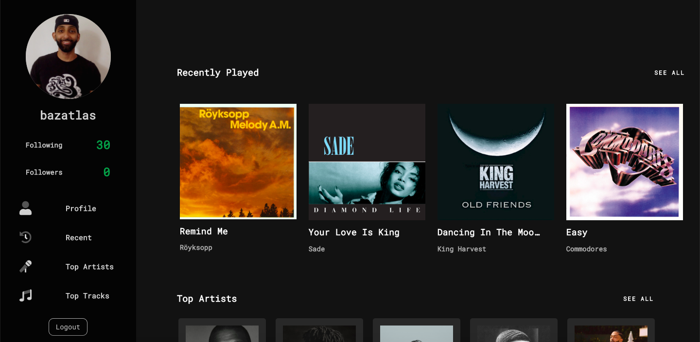

<h2 align="center">My Spotify Dashoard - <a target="_blank" href="https://myspotify-dashboard.herokuapp.com/">Demo</a>. </h2>

My Spotify Dashboard is a Full-Stack React application that leverages Spotify's API to display information about the user's listening habits. The user can find recently played tracks, top tracks, and top artists. The backend is using NodeJS and the frontend is using OAuth for authentication.

---

<h2 align="left">Screenshot</h2>

  

---

<h2 align="left">Todo</h2>

- Pull in more data.
- Add mobile responsiveness.
- Add documentation.
- Set up instructions for deployment.
- Organize folder structure.

---

<h2 align="left">More info . . .</h2>

 Project By <a target="_blank" href="https://bazen.dev">Bazen Berhane.</a> | Icons Provided by <a target="_blank" href="https://fontawesome.com">Font Awesome.</a> 

